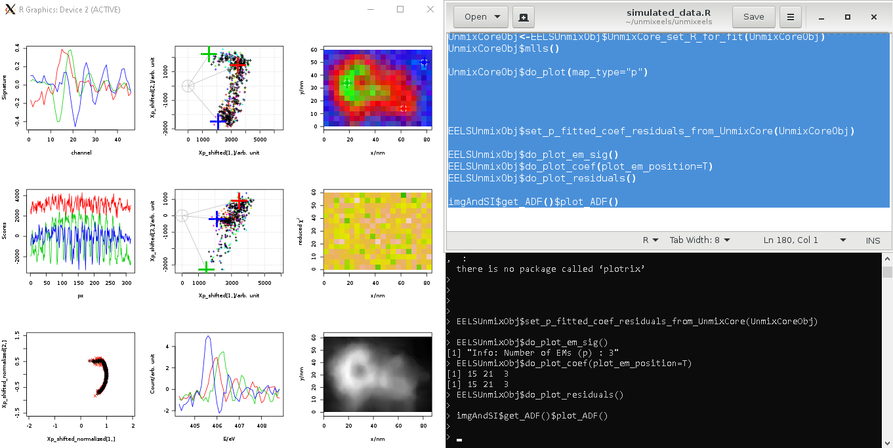

unmixeels
===

* An open-source software framework of hyperspectral unmixing for energy-loss near-edge fine structure analysis. 

* This framework gives quantitative results for 
   1) number of independent spectral components. 
   2) the signature of each spectral component. 
   3) the abundance of each spectral component in each pixel. 

* This framework includes an "unsupervised" unmixing process. Reference spectra from other sources are not needed. 

See `simulated_data.R` for more information



|          |               |       |
|----------|:-------------:|------:|
| PCA/SVD Signatures |  Data & EMs in Dimension 1&2 | **Abundance map** |
| PCA/SVD Scores |    Data & EMs in Dimension 1&3   | **Residual map** |
| Normalized Data | **Spectral Signatures** | **ADF image** |

### Installation

1. Install `gcc`, `make` and `R` on your Linux system. 
   On Debian/Ubuntu, run 
   ```
   sudo apt-get install build-essential r-base
   ```
2. Install `R6` library for R. 
   Run R from terminal, then run the following command:
   ```
   > install.packages("R6")
   ```
   You may also want the "plotrix" library: 
   ```
   > install.packages("plotrix")
   ```
2. Download and unpack the source package. (If `git` is not installed on your system, install them first. On Debian/Ubuntu, run `sudo apt-get install git`)
   ```
   git clone https://github.com/sironglu/unmixeels.git
   cd unmixeels/
   ```
3. Compile `libdmformat` :
   ```
   cd libdmformat 
   make 
   cd ..
   ```
4. Compile subroutine `my_gaussian_1.c` :
```
   gcc -Wall -O2 -fPIC -o my_gaussian_1.so my_gaussian_1.c -shared -lm -lR
```

### Usage

1. Copy your dm3/dm4 files to the same directory as the `simulated_data.R`
2. Modify the values of `use_simulated_data` and `FILENAME*` variables accordingly, or use the simulated data. 
3. Modify other parameters in the source code accordingly. 
4. Copy and paste the source code in `simulated_data.R` file into your `R` terminal. 

## For Windows 10 Users

The easiest way to get Debian/Ubuntu on your Win10 system might be using the Windows Subsystem for Linux (WSL). 
1. Set up WSL first by following [the guide](https://docs.microsoft.com/en-us/windows/wsl/install-win10).
2. Get [Debian](https://www.microsoft.com/en-us/p/debian/9msvkqc78pk6) or [Ubuntu](https://www.microsoft.com/en-us/p/ubuntu/9nblggh4msv6) from Microsoft Store. 
3. Download and install [Xming X Server](https://sourceforge.net/projects/xming) for graphic display. 
4. Launch the Xming app, then launch the Debian/Ubuntu app. Install unmixeels and all necessary software packages as mentioned above. 
5. On the terminal of the Debian/Ubuntu app, run
   ```
   export DISPLAY=:0
   ```
   Now your Debian/Ubuntu app should be able to communicate with your Xming app. To test, run `R` from the terminal and make a simple plot by typing `plot(0)`. A graphic window would pop up with the plot. You can now copy and paste the source code from `simulated_data.R` file onto the R command line interface. 
